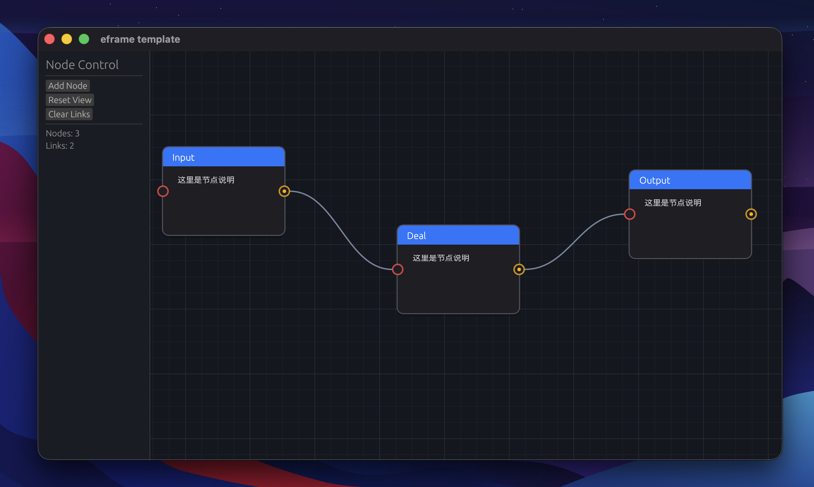

# Renode

一个基于 `eframe` / `egui` 的 Rust 桌面节点编辑器示例，重点用于学习图形界面里的状态管理、输入处理和渲染流程。



## 当前功能

- 节点拖拽与画布平移
- 输入/输出端口连线
- 右键删除连线
- 节点标题与正文可编辑
- 网格背景与全局缩放

## 快速开始

```bash
cargo run --release
```

## 快捷键

- `Command + +` 或 `Command + =`：放大
- `Command + -`：缩小
- `Command + 0`：恢复 100%

在 Windows / Linux 上，`Command` 对应 `Ctrl`。

## 项目结构

- `src/app.rs`：节点编辑器核心逻辑
- `src/main.rs`：应用入口与窗口配置
- `src/lib.rs`：模块导出
- `.github/workflows/rust.yml`：CI
- `.github/workflows/build-desktop.yml`：Windows / macOS 构建产物

## 自动构建产物

推送到 `main` 或手动触发后，GitHub Actions 会自动生成：

- Windows x64 可执行文件
- macOS Intel 可执行文件
- macOS Apple Silicon 可执行文件
